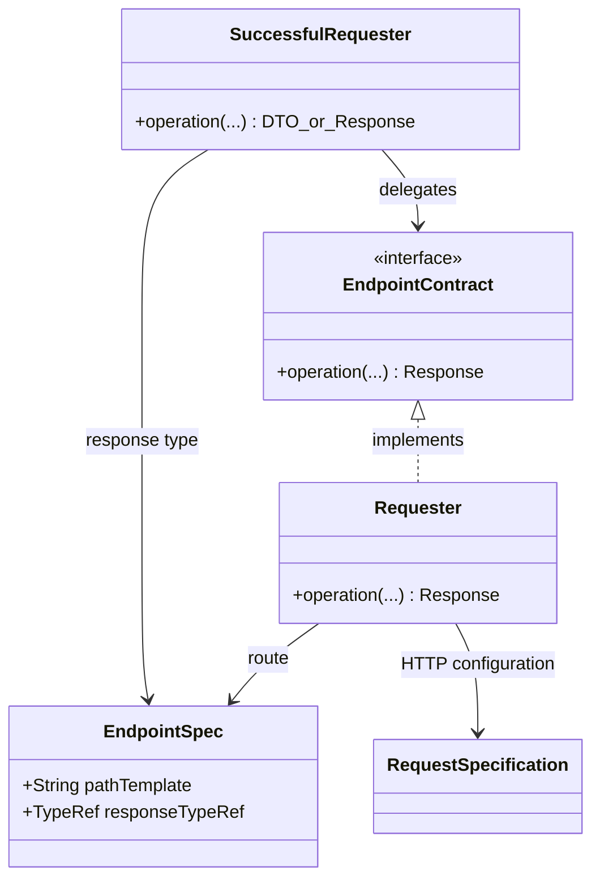
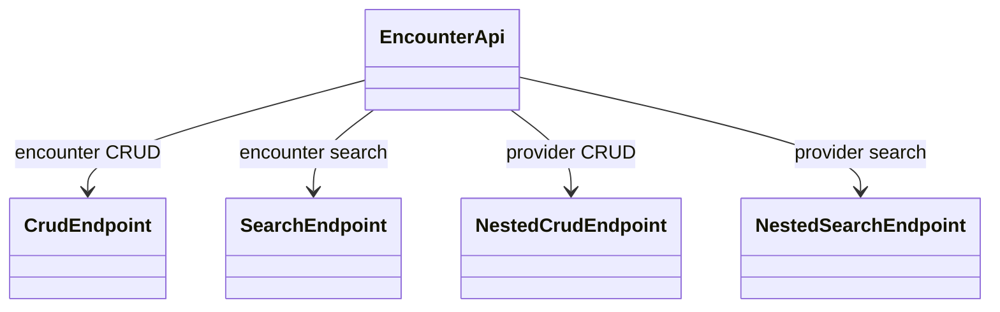
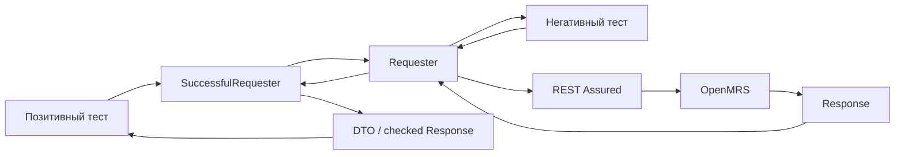

# Архитектура слоя API Requesters

Статус: предложение для согласования с преподавателем. Дата анализа OpenMRS API: 12 сентября 2026 года.

## 1. Краткий итог

CRUD — только один из типов endpoint'ов, а не универсальный интерфейс для любого HTTP-запроса.

Для каждого типа используется трехуровневая структура:

```text
Interface
    ↓ implements
Requester
    ↑ delegates
SuccessfulRequester
```

- `Interface` описывает только характерные для типа операции.
- `Requester` отправляет запрос и возвращает полный `Response` без предположения об успехе.
- `SuccessfulRequester` вызывает обычный requester, проверяет успешный контракт и возвращает DTO либо проверенный `Response`.

Для текущего покрытия нужны пять типов: `Auth`, `Crud`, `Search`, `NestedCrud` и `NestedSearch`. Вспомогательная генерация patient identifier через IDGen не является test target и выполняется отдельным прямым `POST` из test-data helper.

## 2. Источники истины и границы анализа

Источники перечислены в порядке приоритета:

1. Swagger работающего целевого OpenMRS deployment.
2. Сохраненный snapshot [`infra/o3-api.yaml`](../../infra/o3-api.yaml), версия `2.8.0-42ce79`.
3. [OpenMRS REST API](https://rest.openmrs.org/) как высокоуровневая документация.

Docker Compose использует плавающий тег `qa`, поэтому snapshot и работающий deployment могут различаться. Перед реализацией контрактов, отсутствующих в snapshot, их необходимо проверить на текущем стенде.

### В текущем scope

- Auth: получение сессии и logout.
- Patient и его subresources: identifier, allergy.
- Person и его subresources: name, address, attribute.
- Visit и его subresource attribute.
- Encounter и его subresource encounterprovider.
- Observation (`/obs`).
- User.
- `POST /idgen/identifiersource/{sourceUuid}/identifier` только как вспомогательная генерация identifier для Patient.

### Вне текущего scope

- `/password` и `/visitconfiguration`.
- CRUD identifier sources, reserve identifiers, `uploadFromSource`, `uploadFromFile`.
- Остальные OpenMRS resources.
- Проектирование DTO всего API и бизнес-логики Steps за пределами показанной композиции.

## 3. Наблюдения OpenMRS

Подробные доказательства и полный перечень операций находятся в [инвентаризации](openmrs-api-inventory.md).

| ID | Наблюдение |
|---|---|
| `OMRS-01` | Все шесть основных ресурсов имеют collection GET/POST и item GET/POST/DELETE. |
| `OMRS-02` | List и search выполняются одним GET коллекции и различаются только query parameters. |
| `OMRS-03` | Person, Patient, Visit и Encounter имеют вложенные subresources с parent UUID. |
| `OMRS-04` | Patient allergy поддерживает nested CRUD, но не имеет collection GET в текущем Swagger. |
| `OMRS-05` | Все GET-операции выбранных ресурсов поддерживают representation через параметр `v`. |
| `OMRS-06` | Все DELETE-операции выбранных ресурсов поддерживают `purge`. |
| `OMRS-07` | OpenMRS update выполняется через `POST` item URL, а не через `PUT` или `PATCH`. |
| `OMRS-08` | Auth использует `GET /session` и `DELETE /session`; HTTP 2xx недостаточно без проверки `authenticated`. |
| `OMRS-09` | Один identifier генерируется командой `POST` на URL конкретного IdentifierSource с пустым JSON body `{}`. |
| `OMRS-10` | Идентификаторы API безопаснее представлять как `String`, а не ограничивать `UUID`. |

## 4. Наблюдение → решение

| Наблюдение | Архитектурное следствие | Решение |
|---|---|---|
| `OMRS-01`, `OMRS-07` | Для полного resource CRUD повторяется один контракт. | `CrudEndpoint` и update через `POST`. |
| `OMRS-02` | Пустой list — частный случай поиска без фильтров. | `SearchEndpoint`; комбинации фильтров не создают новые интерфейсы. |
| `OMRS-03`, `OMRS-04` | Вложенные операции требуют parent ID; наличие nested list независимо от CRUD. | Отдельные `NestedCrudEndpoint` и `NestedSearchEndpoint`. |
| `OMRS-05` | Item GET должен уметь выбирать форму ответа. | `ReadOptions` передается в обычный и nested `get`. |
| `OMRS-06` | Purge — опция удаления, а не новый endpoint-тип. | `DeleteMode.DEFAULT/PURGE`. |
| `OMRS-08` | Сессия не является CRUD-ресурсом. | `AuthEndpoint` с `getSession` и `logout`; successful-слой проверяет семантику. |
| `OMRS-09` | IDGen нужен только как техническая подготовка test data, а не как область тестирования. | Не создавать для него endpoint-тип: выполнить прямой `POST` в `PatientTestData`, source UUID взять из properties. |
| `OMRS-10` | UUID-подобный формат не должен ограничивать контракт. | Все resource IDs передаются как `String`. |

## 5. Архитектурные инварианты

1. Обычный requester всегда возвращает `Response` и не применяет позитивную `ResponseSpecification`.
2. Successful requester отправляет запрос только через обычный requester и не дублирует REST Assured-вызов.
3. Успешность включает ожидаемый HTTP status и обязательные семантические условия, например `authenticated == true`.
4. Интерфейс не объявляет операцию, которую сконфигурированный requester выполнить не может.
5. Один тип endpoint'а описывает повторяющийся контракт, а не конкретный ресурс или произвольный HTTP-метод.
6. Конкретный ресурс переиспользует типовые requester'ы через конфигурацию и композицию.
7. Новый endpoint-тип добавляется только для операции из актуального scope, которую нельзя честно выразить существующими контрактами.
8. Steps/facade задает предметные имена и связывает несколько запросов, но не дублирует низкоуровневый HTTP-код.

## 6. Общая UML-модель



Разница возвращаемых значений принципиальна: `Requester.operation(...) → Response`, а `SuccessfulRequester.operation(...) → DTO` или проверенный `Response`.

## 7. Активные типы endpoint'ов

| Тип | Interface | Raw implementation | Positive wrapper |
|---|---|---|---|
| Auth | `AuthEndpoint` | `AuthRequester` | `SuccessfulAuthRequester` |
| CRUD | `CrudEndpoint` | `CrudRequester` | `SuccessfulCrudRequester` |
| Search | `SearchEndpoint` | `SearchRequester` | `SuccessfulSearchRequester` |
| Nested CRUD | `NestedCrudEndpoint` | `NestedCrudRequester` | `SuccessfulNestedCrudRequester` |
| Nested Search | `NestedSearchEndpoint` | `NestedSearchRequester` | `SuccessfulNestedSearchRequester` |

### 7.1. Auth

```java
public interface AuthEndpoint {
    Response getSession(Credentials credentials);
    Response logout();
}
```

`AuthRequester` возвращает raw response для позитивных и негативных сценариев. `SuccessfulAuthRequester.getSession` ожидает успешный HTTP status, проверяет `authenticated == true` и возвращает `SessionResponse`. `logout` возвращает проверенный `Response`, потому что успешное тело не требуется.

### 7.2. CRUD верхнего уровня

```java
public interface CrudEndpoint<CREATE, UPDATE> {
    Response create(CREATE request);
    Response get(String id, ReadOptions options);
    Response update(String id, UPDATE request);
    Response delete(String id, DeleteMode mode);

    default Response get(String id) { /* default representation */ }
    default Response delete(String id) { /* DEFAULT mode */ }
}
```

Один `CrudRequester` получает полный набор спецификаций create/get/update/delete. Для текущего scope все основные ресурсы честно поддерживают этот контракт.

Начальный successful-контракт использует одну response-модель для create/get/update:

```java
public class SuccessfulCrudRequester<CREATE, UPDATE, RES> {
    public RES create(CREATE request);
    public RES get(String id, ReadOptions options);
    public RES update(String id, UPDATE request);
    public Response delete(String id, DeleteMode mode);
}
```

### 7.3. Search

```java
public interface SearchEndpoint<PARAMS extends QueryParams> {
    Response search(PARAMS params);
}
```

Одна params-модель представляет список и все поддерживаемые комбинации фильтров. Representation, pagination и resource-specific filters входят в эту модель. Successful-слой возвращает типизированную collection response-модель.

### 7.4. Nested CRUD

```java
public interface NestedCrudEndpoint<CREATE, UPDATE> {
    Response create(String parentId, CREATE request);
    Response get(String parentId, String id, ReadOptions options);
    Response update(String parentId, String id, UPDATE request);
    Response delete(String parentId, String id, DeleteMode mode);
}
```

Контракт используется всеми согласованными subresources, включая Patient allergy. Collection GET в него не входит.

### 7.5. Nested Search

```java
public interface NestedSearchEndpoint<PARAMS extends QueryParams> {
    Response search(String parentId, PARAMS params);
}
```

Тип применяется только там, где Swagger объявляет collection GET. Поэтому Patient allergy использует `NestedCrudEndpoint`, но не `NestedSearchEndpoint`.

## 8. Сквозные решения

### 8.1. EndpointSpec и группы операций

```java
public record EndpointSpec<RES>(
        String pathTemplate,
        TypeRef<RES> responseTypeRef
) {
}
```

Один `EndpointSpec` относится к одной операции и хранит ее путь и тип успешного тела. HTTP-метод остается частью типового requester'а. Для CRUD и Nested CRUD отдельная группа связывает четыре спецификации, чтобы один экземпляр requester'а реализовывал весь контракт.

`EndpointSpec<Void>` допустим для DELETE как внутренняя конфигурация, но `DELETE_RES` не становится generic-параметром публичного successful requester'а.

### 8.2. Representation

`ReadOptions` передает query parameter `v` для item GET:

```java
public record ReadOptions(String representation) {
    public static ReadOptions defaults();
    public static ReadOptions ref();
    public static ReadOptions defaultRepresentation();
    public static ReadOptions full();
    public static ReadOptions custom(String fields);
}
```

- `ref` — сокращенная ссылка на ресурс.
- `default` — стандартное представление.
- `full` — расширенное представление.
- `custom:(...)` — явно выбранные поля.

Вызов `get(id)` использует default behavior API без параметра `v`; `defaultRepresentation()` явно передает `v=default`, а `full()` — `v=full`.

### 8.3. DeleteMode

```java
public enum DeleteMode {
    DEFAULT,
    PURGE
}
```

`DEFAULT` выполняет обычное delete/void/retire-поведение ресурса. `PURGE` добавляет `purge=true`. Successful delete проверяет `204` и возвращает проверенный `Response`.

### 8.4. Response-модели

На первом этапе create/get/update одного ресурса используют общий `RES`. Это сохраняет `SuccessfulCrudRequester<CREATE, UPDATE, RES>` простым.

Если несколько реальных ресурсов подтвердят разные response-контракты, successful-слой расширяется до отдельных `CREATE_RES`, `GET_RES` и `UPDATE_RES`. Raw interface и raw requester при этом не меняются. Единичное исключение обрабатывается предметной successful-оберткой, а не усложняет общий тип.

## 9. Распределение по ресурсам

| Область | Crud | Search | NestedCrud | NestedSearch | Auth |
|---|---:|---:|---:|---:|---:|
| Auth `/session` |  |  |  |  | ✓ |
| Patient | ✓ | ✓ | identifier, allergy | identifier |  |
| Person | ✓ | ✓ | name, address, attribute | name, address, attribute |  |
| Visit | ✓ | ✓ | attribute | attribute |  |
| Encounter | ✓ | ✓ | encounterprovider | encounterprovider |  |
| Observation | ✓ | ✓ |  |  |  |
| User | ✓ | ✓ |  |  |  |

IDGen намеренно отсутствует в таблице requester-типов. Это один прямой служебный `POST` в `PatientTestData`, используемый только перед созданием Patient.

## 10. Композиция Encounter



`EncounterApi` дает тестам предметный вход, но каждая операция остается реализована соответствующим типовым requester'ом.

## 11. Поток позитивного и негативного сценария



## 12. Текущее и целевое состояние

Базовый requester layer уже реализует пять троек, operation groups, `EndpointSpec`, `ReadOptions`, `DeleteMode` и Auth. Старые универсальные обертки удалены. IDGen оставлен за границей requester layer как прямой вызов из `PatientTestData`.

Следующий этап — подключать слой к предметным vertical slices без создания DTO заранее:

1. Подключить Auth к интеграционным тестам и проверить контракт на `qa`.
2. Добавить DTO и operation specifications для Observation CRUD и Search.
3. Добавить EncounterProvider Nested CRUD и Nested Search.
4. Распространить проверенные конфигурации на остальные ресурсы scope.
5. Использовать `PatientTestData.generateIdentifier()` при подготовке Patient test data.

## 13. Принятые и отложенные решения

| Статус | Решение |
|---|---|
| Принято | List вызывает `SearchEndpoint` с пустыми query parameters, а поиск — с фильтрами. Для nested search отдельный контракт нужен из-за обязательного parent ID. |
| Принято | Auth включает получение и завершение сессии; item GET поддерживает `ReadOptions`. |
| Принято | Successful CRUD начинает с одного `RES`; full CRUD requester получает четыре operation specifications. |
| Принято | IDGen не образует отдельный endpoint-тип: `PatientTestData` отправляет прямой `POST`, а UUID источника `OpenMRS ID` хранится в properties. |
| Отложено | Разные create/get/update response-типы в общем successful requester. |
| Отложено | Новые endpoint-типы и произвольные path parameters не вводятся до появления подтвержденной необходимости. |
| Вне scope | Password actions, Visit configuration и остальной IDGen API. |

## 14. Критерии готовности реализации

- Каждая операция основных ресурсов и Auth из [инвентаризации](openmrs-api-inventory.md) сопоставлена ровно одному активному типу; служебный IDGen-вызов явно отмечен как test-data setup вне слоя.
- Все пять активных типов имеют Interface, Requester и SuccessfulRequester.
- Raw requester позволяет проверять любой полученный статус и тело.
- Successful requester не дублирует HTTP-вызов.
- Auth проверяет `authenticated`, а item GET передает representation.
- `PatientTestData.generateIdentifier()` отправляет прямой IDGen `POST` и возвращает поле `identifier`.
- Полные примеры из [приложения](api-requester-examples.md) соответствуют контрактам этого документа.
